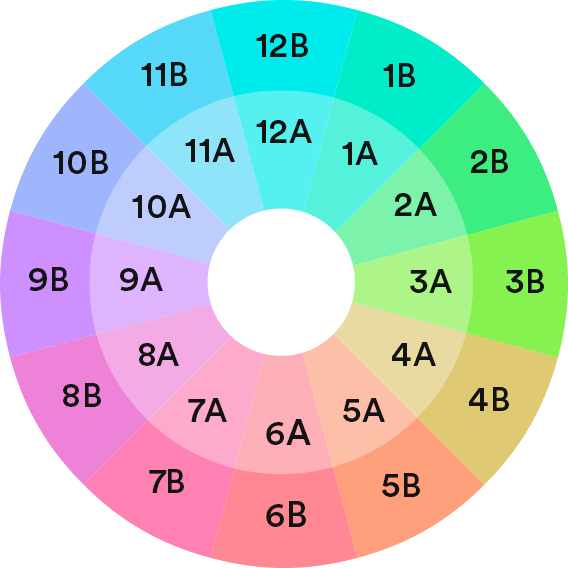
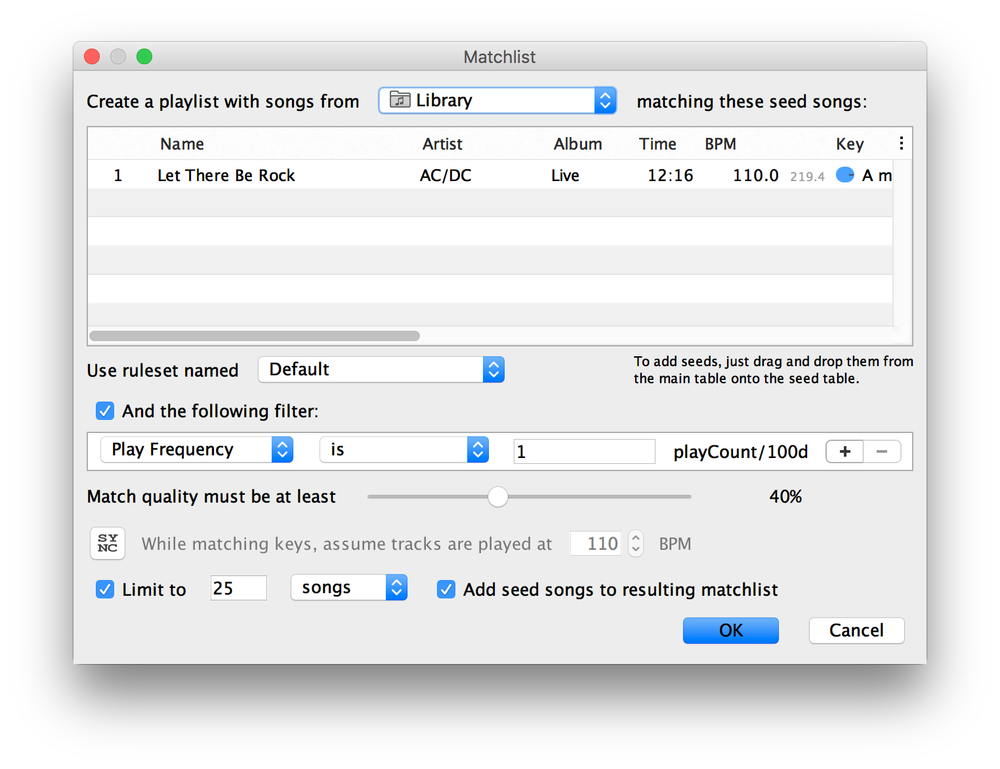

=== DJ tools / software

https://zen.yandex.ru/media/zhiviprosto/top-10-programm-dlia-didjeev-5bfdab5d06d7e800ab309344

WARNING: to use materials from https://www.digitaldjtips.com/2013/05/music-library-organisation-part-4/

==== Analyze your music
Refer to link:https://www.digitaldjtips.com/2013/05/music-library-organisation-part-4/[https://www.digitaldjtips.com]

Regardless of the recommendations in this article or that from other people, the most important thing is that you *classify your music* in a way that works for you and your DJ set-up.

This encompasses more than just whether you can be bothered to put a structure in place. This is about how the library will be used, where and when it is to be accessed and what you expect to get out of it. This stuff is more important than whether you choose to rename your files in a certain way, or what folder names you go for.

Radio case: all tracks are played automatically. This process is the only for us to control the process.

For program to understand what track to play next, how and when stop... We need to organize collection in desired way.

[.lead]
The important questions to ask before you begin
====
Some of this might seem obvious but you can break it down by asking yourself questions like these:

. When I DJ, what track attributes or information do I need to help me find a track, know when I should use it and whether it will mix in with my set plan?
. If I am not able to have my entire music library with me to listen or DJ with, what track information will help me decide what to take with me or how to arrange playlists that I can have?
. When I am just listening to my music library, how can I learn more about the music tracks and how they might fit together in a mix?
. Does the software or hardware I use to DJ or play back music have any restrictions or requirements on how my music should be organized?
====

.What we have to consider:
* Folder structure
* Filenames
* Tags and metadata

==== Beat Jumping with Cue Points

Cue Points mark different parts of your song, and help you locate the parts that you want to play. They are like little flags that say “Here’s an interesting part at 30 seconds, and another one at 1 minute.”

Cue paints are the 2nd step after choosing the files for your collection

https://www.youtube.com/watch?v=K1gX1vnjeto&feature=youtu.be
// replace with tutorial with noo ads

Collection >> cu-points >> bpm, color, .... >> playlists >> rehearsal, ... >> mixing >> rehearsal, processing >> broadcasting

Most DJ software supports up to 8 cue points per track, but you have to set them manually.
Fortunately for you, some apps (Mixed In Key) will detect the best cue points and set them automatically, so you don’t have to do everything by hand.
// Our cue points “snap” to the beatgrid, so they will always be on beat.

* mixed in key
https://mixedinkey.com/

.Harmonic Mixing for DJs and Music Producers

https://mixedinkey.com/harmonic-mixing-guide/

Mixing from inner circle to outer circle

For a pleasant harmonic mix, you can keep the same number, but change the letter. For example, 8A goes with 8B because the number 8 is the same. You can mix between them.

That gives you four great options. If you’re looking at your Mixed In Key results and trying to decide what song to play next, look for something that’s adjacent to your current Key Code. All of those songs will be harmonically compatible.

* Beatunes https://www.beatunes.com/en/beatunes-play.html

trial version https://www.beatunes.com/en/beatunes-download.html

image::images/materials-57886.png[]

==== Grouping tracks

You can get various features for your collection, not always you can export them and use in production, but you can organize playlists beforehand in 100% cases.

Trial version - no cool export. Possible to export playlists and more.

Creating good playlists is hard. But help is on the way! beaTunes offers you Matchlists.

Matchlists are a hybrid of iTunes-like smart playlists and Genius. Instead of following hard rules, matchlists are created with a couple of seed songs and a set of soft rules.

trial version https://www.beatunes.com/en/beatunes-download.html

* Get the free beaTunes trial version for Windows or Mac and install it on your computer
* Start beaTunes
* Analyze your library for beats per minute (BPM), key, color, and language
(the more information about each song is available, the better the matchlist)
* Select a couple of songs that you would like the matchlist to sound like - these are your seed songs
* Now click on the New Matchlist button in the toolbar
beaTunes will display the matchlist dialog:

* Choose the source of the songs for your new matchlist
beaTunes awards a match quality percentage for each song from your source - choose how well songs have to match the seed songs to make it into the list
* Usually it is a good idea to limit the number of songs you would like to add to the new playlist
* After you clicked OK, beaTunes creates the new list and saves it

.Matchlists aren't perfect
* BUT, usually a lot better than shuffle or some obscure 'smart' playlists.
* And if you don't like the outcome right away, you can easily custom tune the mechanism for creating better versions. In the application preferences you can assign more or less weight to the rules that detect a similar BPM, a similar color, or other attributes of your songs.

beaTunes has a lot more useful features to link:https://www.beatunes.com/en/itunes-tonal-key-analysis.html[detect the key of your songs], link:https://www.beatunes.com/en/itunes-replay-gain.html[adjust loudness via ReplayGain], link:https://www.beatunes.com/en/itunes-library-inspection.html[keep your library in shape], link:https://www.beatunes.com/en/beatunes-play.html[browse your songs in new ways], link:https://www.beatunes.com/en/itunes-automatic-bpm-detection.html[analyze your music], and help you to create interesting playlists

[abstract]
Be smart, Save your time and Enjoy your music

=== Resources

Beginner level

* introduction to phrases listening for DJs
https://www.youtube.com/channel/UCJclu179fTru8tmpZ9jPI1w
* mixing in key theory explained
https://www.youtube.com/watch?v=R7bhKIngo5c

DJ tutorials
* CUE points completely explained https://www.youtube.com/watch?v=ZXOtzZM72OY&list=LL&index=196
* pro mixing example
https://www.youtube.com/watch?v=1puXhnX-Rmo&list=WL&index=61
