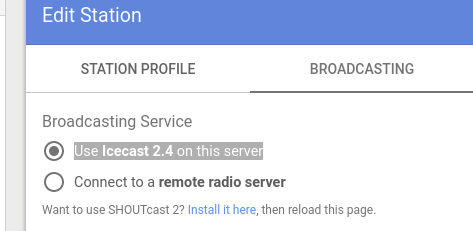

= lecture
:hide-uri-scheme:
:author: Timur Chikichev
:email: timur.chikichev@skoltech.ru
:source-highlighter: pygments
// :pygments-style: emacs
// :stem: latexmath

Discord webhooks integration
link:https://support.discord.com/hc/ru/articles/228383668-%D0%98%D1%81%D0%BF%D0%BE%D0%BB%D1%8C%D0%B7%D0%BE%D0%B2%D0%B0%D0%BD%D0%B8%D0%B5-Webhooks[webhooks]

== Setup azuracast radio server

All settings guide:
https://www.azuracast.com/administration/station/

System Requirements

* A 64-bit x86 (x86_64) CPU
* 2GB or greater of RAM
* 20GB or greater of hard drive space
* A computer/server capable of running Docker

IMPORTANT: ubuntu 16-20 is a good option

TIP: for ubuntu docker installlation try this instruction first https://www.digitalocean.com/community/tutorials/how-to-install-and-use-docker-on-ubuntu-20-04-ru

  sudo apt update
  sudo apt install apt-transport-https ca-certificates curl software-properties-common
  curl -fsSL https://download.docker.com/linux/ubuntu/gpg | sudo apt-key add -
  sudo add-apt-repository "deb [arch=amd64] https://download.docker.com/linux/ubuntu focal stable"
  sudo apt update
  apt-cache policy docker-ce

====
  docker-ce:
    Installed: (none)
    Candidate: 5:19.03.9~3-0~ubuntu-focal
    Version table:
       5:19.03.9~3-0~ubuntu-focal 500
          500 https://download.docker.com/linux/ubuntu focal/stable amd64 Packages
====

  sudo groupadd docker
  sudo usermod -aG docker username
  id -nG

=== Docker Self-Installation

https://www.azuracast.com/install/docker.html

image::images/adocfile-584da.png[]

  sudo su -

  mkdir -p /var/azuracast
  cd /var/azuracast

  curl -fsSL https://raw.githubusercontent.com/AzuraCast/AzuraCast/master/docker.sh > docker.sh
  chmod a+x docker.sh
  ./docker.sh install

.main board

.maintenance

.system settings

go and set base url to our server

in this web interface we write a path to the server, if we installed the server locally, the path will be localhost.

TIP: broadcasting to remote server is done not here

.manage stations option

here we create the station, then go into *edit* option

=== Edit station options

.edit station / administration

here we can set the path for local directories

TIP: use this settings to set recording path

WARNING: really don't know how to import music in a convenient way

=== Setup remote relay

we use icecast2 on server,

Remote Station Listening URL *::
http://scorpios.su:8000/

Remote Station Listening Mountpoint/SID::
/xxxxxxxxxxx.mp3

Broadcast AutoDJ to Remote Station::
really not sure, use *yes*

AutoDJ Format::
use any

AutoDJ Bitrate (kbps)::
use any

Remote Station Administrator Password::
swRMT8vpB99xhMgZ

Remote Station Source Password::
4KQjMv3GTvwefT44

.mount points

